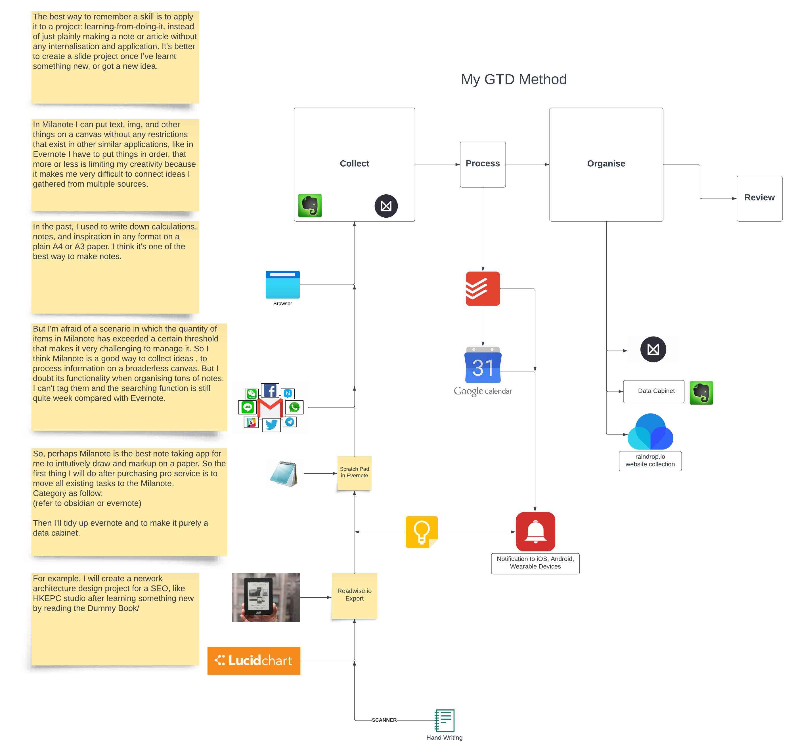

- What I did on last Friday and Saturday
	- For Dardanup project:
		- updated the main report and summary report with latest economic summary result, updated 5000kg and 20000kg cases.
		- edited the text description in both reports
		- uploaded them to slack channel on Saturday
	- Townsville solar farm:
		- Put labels on the 3d diagram
		- put some 3d objects into the 3d model such as vehicles, storage tanks, hydrogen cars, roof panels and some details
- Daily about PKM
  collapsed:: true
	- In the past week, I spent a dozens of hours on building my first digital garden, a.k.a. Personal Knowledge Management (PKM). I switched from Obsidian to Logseq. There are markdown-based note-taking app but the philosophy behind them are different. Obsidian is a typewriter like evernote or word that means I need to type sentences. But in Logeq the atomic unit is a block. I can put anything in a block. Every page has two-way backlink functions. It is actually an outliner not a typewriter. Now I'm relying on GitHub for synchronising data between devices.
	- Another thing I did was to build an online ebook library for my personal use. I downloaded some books from Z-Lib, ranging from English learning, self-help, light novels and so on. I am going to put all archi books to there and it will become my virtual bookshelf, full of pirate books because I can't afford a physical book collection T_T, I'll put some reference document relating to my work to the server.
	- I went through a book written by a korean.
		- [整理想法的技術：讓你避免腦袋一片混亂、語無倫次的13項思緒整理工具](http://mikosuisui.xyz:8083/book/53)
	- He proposed 13 tools for organising my own thought; also he has some tips about reading a book and memorising the content of a book by raising questions. So I am trying to use [[ChatGPT]] to summarise the content page of [How to Take Smart Notes](http://mikosuisui.xyz:8083/book/50) then convert the content page to a meaningful story. It is amazing. So by raising more and more questions our brain has new insight and they drive me to look for answers. I'll find some methods to summarise or make an outline of a book later.
	- Here are something I still need to do:
		- moving those doujinshi to the library
		- Reading list for self-help books
		- Reading list for English learning books (I've gone through the whole grammar books today)
		- ditto for Japanese
		- ditto for fiction books (light novels or comics)
	- So here is a list of tools as my 2nd brain I am using:
		- PKM- Logseq
		- Note-taking app - Evernote
		- Calendar - Fantastical
		- Todo mission orgainser - Todoist
		- Virtual bookshelf - Calibre Web hosted on VPS ((6414801c-92aa-4e77-9b26-2179ebe14659))
		- Source management tool (if I need it again in the future) = Zotero
		- Pending tools:
			- Whiteboard
			- mindmap
	- Here is the GTD method I used before (I can't tell the exact date):
		- {:height 214, :width 647}
	- It focused on GTD method: Collect - Process - Organise and Review.
	- But the problem is that the tools I adopted here was extremely discrete and difficult to create a platform to integrate all information. I put all new stuff into the Evernote inbox. In the Evernote I have four main notebooks in tree structure: **P**roject - **A**reas - **R**esources - **A**rchive; then each of them has another set of inbox. It is a brain-power demanding approach and I don't think Evernote is suitable for me anymore. I need a centralised tool, with a mesh topology not tree, so that I can browse different page without any stress. I bookmarked some articles about the difference between traditional note-taking app and some new apps such as Roam, Logseq, Notion and Logseq.
	- Here is a new chart dated [[Mar 20th, 2023]] still in progess
	- So now the inbox will be mainly Todoist. I'm still implementing GTD method inside Todoist to organise missions. All actionable things will be sent to Todoist from emails, slip note, other information sources and insight. I will break a mission down into smaller sub-tasks in Todoist. This helps to clarify the task and make it more manageable. Evernote will become a source of information instead of a place for process and organise instead. Todoist is still handling Organise works. The lists and categories that help me keep track of my tasks and projects. Some of the lists that I  created include a "next actions" list, a "waiting for" list, a "someday/maybe" list, and a "projects" list. Then in fantastical I can have a big picture of what's going on.
	- In 2017 I started following the method introduced by Enor, a blogger from Taiwan, to build up my first 2nd brain on Evernote. I followed his method: setting up a Inbox, a Now notebook, a Future notebook and an Archive notebook. Then I created many many tags under bigger tags in tree structure. I was extremely difficult to manage tbh, and the search function is not as effective as what I have now. No backlink fuction was there so i was not able to locate a note I needed on time.
-
- Added [[Fashion]] page on [[Mar 20th, 2023]] and I will put some of my favourite brands or brands I used to like.
-