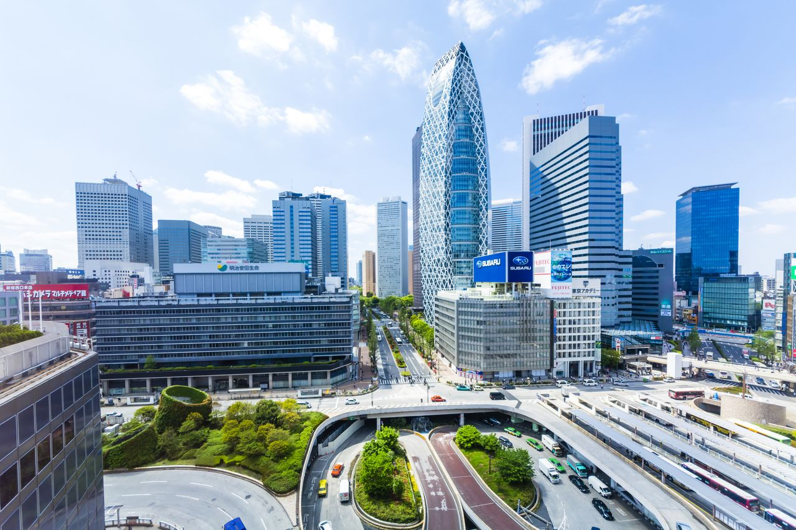

- # Becoming a Tokyo Center: A History of Shinjuku
- 
- **A New Center for Tokyo**
  Shinjuku remained relatively unscathed after the earthquake in 1923, and began its rise to prominence as a shopping district.Takano (高野) moved to a new Western-style building in 1926. The Nakamuraya (中村屋) bakery moved to Shinjuku, owned by Soma Aizo and Kokko, supporters of the Pan-Asian movement.
- The bookstore Kinnokuniya (紀伊國屋書店) was founded in 1927, spitting from the charcoal business company.
- The department store Isetan (伊勢丹) opened for business in 1933. Two years later, it expanded and connecting to station with escalators.
- Various movie theatres were attractions for salarymen, students, and other emerging classes with money to spend.
- **Black Markets and Strip Shows**
- During World War II, air raids destroyed the whole Tokyo. In Shinjuku, only the train station, Isetan, and a few other buildings kept standing on the debris.
- Black markets rose from the ashes at Shinjuku Station's east exit (新宿東口) on August 20, 1945, just five days after Japan's unconditional surrender. Shinjuku became an essential location of selling food, clothing, daily goods and various kinds of entertainment, for people of the war-battered city.
- The 2-chome (新宿二丁目) was a red-light district in postwar era. By the late 1960s it had become Japan's best-known gay neighbourhood, famous for its accepting attidude to satisfying human desires.
- Kabukicho (歌舞伎町) was established in 1948 as a lively but respectable shopping area with an kabuki theatre, althrough the plan was never realized. But the opening of Seibu-Shinjuku Station in 1952, Shinjuku Koma Theater (新宿コマ劇場) in 1956, and the establishments of the Chikyuza cinema (渋谷地球座) contributed to the identity of a leading entertainment district.
- Due to the Anti-Prostitution Act of 1957, sex workers from nearby brothels moved to new establishments in Kabuhicho. "Althrough it is Tokyo's most notorious red-light district, it is generally safe." Lonely Planet stated.
- The Shiki no Michi (四季の路) near the eastern edge of Kabukicho was built on a former streetcar railroad. On its east side is Golden Gai (新宿ゴールデン街). Black market vendors were forced to move there after their stalls outside Shinjuku Station were shut down. There was many unlicensed brothels when prostitution was still legal in designated areas. Later, it developed into an area of bar open until the morning, attracting artists and cultural creators, and it is still well-known today for its drinking establishments.
-
- **A Home for Counterculture**
- Takano (高野) and Nakamuraya (中村屋) moved to new, modern buildings, while Kinokuniya (紀伊國屋書店) was rebuilt in 1964 to become one of the most popular bookstores in Japan.
- In the 1960s, young people and artists met in jazz and classical music cafe to argue issues of aesthetics and politics. The Fugetsudo Cafe (風月堂) was notorious for harbouring US deserters opposing to the Vietnam War and seeking for political asylum in Sweden.
- A movie theatre manager said that "More powerful and compelling real life dramas than any film take place on these streets everyday". This may be still true of Shinjuku today.
-
- **Eternally Unfinished**
- 
- The Yodobashi Water purification Plant (淀橋浄水場) was opened in Shinjuku, Tokyo in 1898 (Meiji 31), as one of the first Japan's modern water works. The Plant was extended several times due to the exceeding demand of water supplies.
- Finally the Plant was shut down in 1968 (Showa 43).
  The site became the Japan's best known CBD, home for Park Hyatt Hotel and Tokyo Metropolitian Government Building designed by Tange Kenzō.
- 
- Modern high-rise buildings occupying the west of Shinjuku Station today
- 
- An aerial shot of the area around Shinjuku Station
-
- Shinjuku transformed from a small village surrounded by trees to a bustling  area rich in variety, including glamorous high-rise buildings and alleys recalling the former black markets.
  Shinjuku could be said to be like Barcelona’s Sagrada Família, in which construction will never end. It will continue its status of a cultural node of East-Asia, yet never overly polished and turning nobody away.
## Reference
[Becoming a Tokyo Center: A History of Shinjuku](https://www.nippon.com/en/japan-topics/g00800/becoming-a-tokyo-center-a-history-of-shinjuku.html?fbclid=IwAR2qaG6IMaYijJPpCL0_WX4hhSHtmNlA0mX7-FTnUkf9w0SLMtpGoQgApI4)