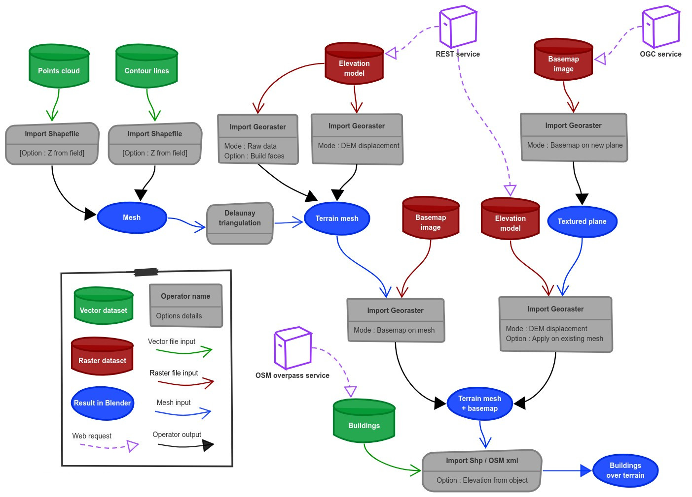

- GIS Courses
	- [Geographic Information Systems (GIS) | Coursera](https://www.coursera.org/specializations/gis) - GIS Coursea Course
-
- ## Tutorial
	- [Creating a 3d model of a city using Blender and BlenderGIS](https://www.youtube.com/watch?v=dwj8npFZSyI) - To use blender and a GIS plugin - [BlenderGIS](https://github.com/domlysz/BlenderGIS) - to create a 3D topography by combining heightmap data and satellite imagery
		- Components required to form a 3D Topo Model
			- Contour lines / Points cloud
			- Terrain Mesh
				- Elevation Model
					- Import from REST service via Geo-raster
			- Terrain Texture Plane
				- Basemap image from OGC service
		-  {:height 523, :width 716}
			-
			-