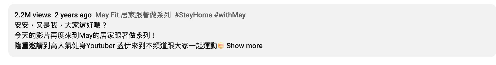

- # Links
- [CalorieKing Calorie Counter for iPhone has a user-friendly interface that allows a quick comparison, of calories, carbs and fat, between foods.](https://program.calorieking.com/control-my-weight/day/2023-03-13)
- [小腿怎麼瘦？5招快速消「蘿蔔腿」運動搭配按摩，20天練成細長漫畫腿](https://www.elle.com/tw/beauty/health/g35870193/legs-exercises-home/)
- [Carbs on Low Carb: How Low Carb Is Low Carb? — Diet Doctor](https://www.dietdoctor.com/low-carb/how-low-carb-is-low-carb)
- [3 Ways to Build Muscle Doing Push Ups - wikiHow](https://www.wikihow.com/Build-Muscle-Doing-Push-Ups)
- [腹肌運動成效差？踏台運動15分鐘，消除鮪魚肚的內臟脂肪！-第2頁](https://www.edh.tw/article/22006/2)
- [室內有氧運動第一名是它！有氧運動每小時燃脂300大卡](https://www.edh.tw/article/10390)
- [爆汗徒手！15分鐘高強度全身居家運動 🔥連男神也撐不住的訓練組合？！Feat. 健人蓋伊](https://www.youtube.com/watch?v=M56to7gX6bE)
- 