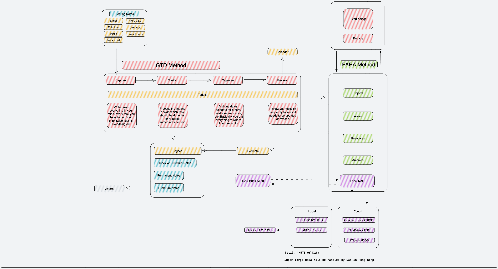

- macOS apps [learn-anything/macos-apps: Awesome macOS apps](https://github.com/learn-anything/macos-apps)
- ### Workflow Diagram
	- {:height 348, :width 628}
	- ## Task manager
	  collapsed:: true
		- [Todoist](https://todoist.com/) - Personal and project task in different tags; following GTD methodology
		- [nikiv's todo list](https://nikiv.notion.site/) - A Good idea of todo list
	- ## Planner
	  collapsed:: true
		- [Fantastical](https://flexibits.com/fantastical) - an excellent app Integrating calendar and todo application
	- ## Chat
	  collapsed:: true
		- [[Discord]] - communities of ACG, Vtuber, Gaming,
		- [[Whatsapp]] - Instant message app
		- [[Telegram]] - become an anonymous
		- [[WeChat]] - Best and indispensable IM app in China for survival
		- [[Line]] - communities of ACG, Vtuber, Japanese-related friends
		- [[Signal]] - Instant message app, alternative to [[Whatsapp]]
	- ## Video conferencing
	  collapsed:: true
		- [[Discord]] - supports game streaming
		- [[zoom]] - an easy-to-use app for meeting and collaboration
	- ## Index
	  collapsed:: true
		- [[Raycast]] - How to search a note with Raycast quickly
	- ## Photo
	  collapsed:: true
		- Google photos - My personal photo/video/images downloaded and received via messenger apps
		- Apple photos - exclusively for iOS
	- ## Track
	  collapsed:: true
		- [[Tracking]] - Track TV, animes, comics, games...
		- [[My belongings]] - Timeline of things I have
	- ## News
	  collapsed:: true
		- [Staying on top of things](https://wiki.nikiv.dev/research/staying-on-top-of-things) - A great approach by Nikiv