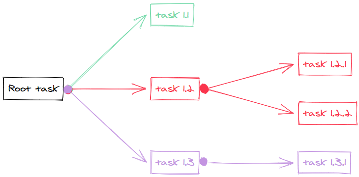

- Step 1: Define the problem first.
- Step 2: How to achieve? Break it down to a series of steps.
- Step 3: Find out the critical path. Determine the urgency and prioritise orders.
- Step 4: Action. Do [[Research]]. Get rid of all non essential parts.
- Step 5: Optimise and simplify
- Step 6: Accelerate by automating the process (optional; and it's the final step)
-
- # Step 1: Define the problem first
- I use [[Todoist]] for projects and personal ideas.
- Following the GTD method - Capture - Clarify - Organise - Process - Review, in there I clarify the problem and divide it into several sub-tasks. A mind map can help if the problem is too complicated.
- When anything valuable comes to mind, write it down on any paper or quick note, put it inside the Inbox. I don't leave it in the brain 🧠. Allocate RAM of the brain to big tasks.
-
- # Step 2: Break it down
- When dealing with subtasks, it's crucial to make sure that each one is actionable. Sort them by priority and then proceed to tackle them one by one.
- [Excalidraw](https://excalidraw.com/) can be a useful visual aid in the brainstorming process, and an alternative option is to use a whiteboard or Xmind.
- Both are great for generating ideas and can be especially helpful when working on complex projects.
- These tools can help you visually map out your thoughts and ideas, helping you to better understand the relationships between different concepts and identify new insights.
- {:height 313, :width 618}
- Remove any useless or unnecessary task during this process.
-
- # Step 3: Determine the urgency
- Assign them a priority tag. Is this problem already solved before? Can we just use it or integrate to save time? Which tasks are critical path in a project?
-
- # Step 4: Action.
- Do it if there are no viable solutions. Solve each sub-task on by one.
- Focus!
- Follow a ((6413e24f-938f-4cd3-a8f0-697dd3aa499f)) to make the process smoother
- Ask effective questions.
-
- # Step 5: Optimise and simplify
- Once you have your first working solution that solves the thing. You can start optimising the solution, if you need.
- Automate the task if you keep repeating the same tasks over and over.