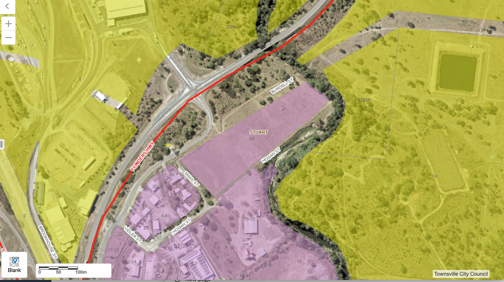

- Address: 57 Burdell Street STUART QLD 4811
	- Scope: New Station
	- Lot No.:
	- Site Area: 41138.7553
	- Zoning:
		- LVL1_ZONE
		  Industry
		- LVL2_ZONE
		  Medium Impact Industry
	- Location Plan:
	- {:height 260, :width 450}
- Satellite Imagery
- Connectivity to Hwy
	- 
- Traffic Flow LV vs HV
- Site 3D with simple massing LOD 100