- Address: 41790 Bruce Highway, Bluewater, QLD 4818
	- Scope:
	- Lot No.
	- Site Area
	- Zoning
	- Location Plan:
- Satellite Imagery
- Connectivity to Hwy
- Traffic Flow LV vs HV
- Site 3D with simple massing LOD 100
- Land parcel
  collapsed:: true
	- The property is located within the Cleveland Bay Industrial Estate (CBIE), Townsville QLD, fallen into Special Purpose zoning.
	- ### Townsville State Development Area
		- Portal: https://www.statedevelopment.qld.gov.au/coordinator-general/state-development-areas/current/townsville-state-development-area
		- The CBIE is within the Townsville State Development Area. (Site starred)
		- 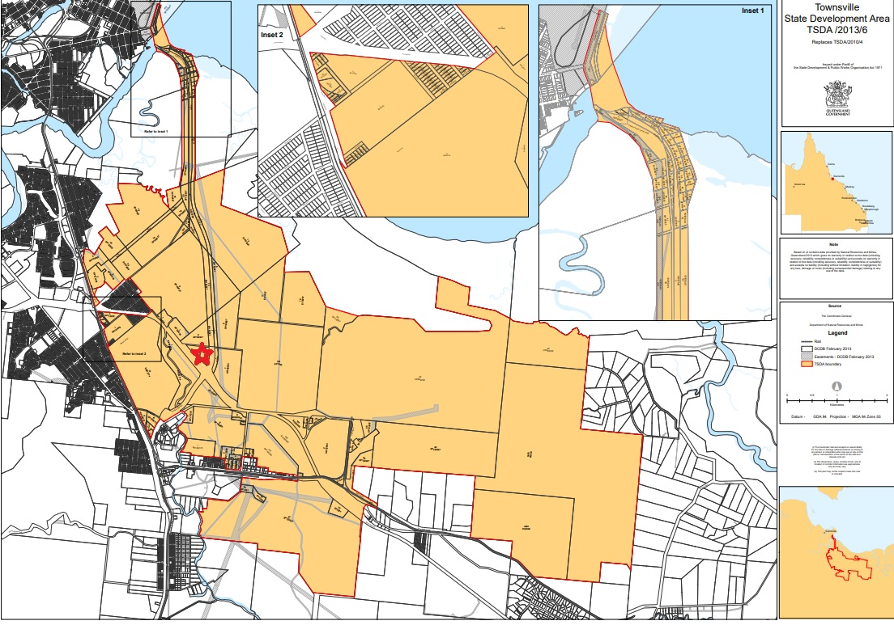
		- Development precinct map: https://www.statedevelopment.qld.gov.au/__data/assets/pdf_file/0024/17448/tsda-development-precincts-map.pdf
		- 
		- Precinct: Medium Impact Industry Precinct
		- The Medium Impact Industry Precinct will facilitate medium impact industrial uses and promote the growth of existing industries where appropriate, including a focus on transport and logistics. See section 2.4.3 of the Townsville SDA development scheme for more information.
		- LAND OWNERSHIP:
			- The majority of land within the Townsville SDA is owned FREEHOLD, with a significant portion owned by a small number of land holders.
			- The Coordinator-General owns 923 hectares within the Townsville SDA. The Coordinator-General's land holdings include land for multi-user infrastructure corridors, including the Townsville Port Access Road and future Townsville Eastern Access Rail Corridor, as well as industrial development and buffer areas.
			- In June 2018, the Coordinator-General acquired approximately 810 hectares to support the acceleration of the Townsville SDA, a key commitment of the [Townsville City Deal](https://www.infrastructure.gov.au/cities/city-deals/townsville/).
			- Acquiring this land allows the Coordinator-General to proactively respond to proponents seeking development opportunities here.
			- View the [land ownership in the Townsville State Development Area](https://www.statedevelopment.qld.gov.au/__data/assets/pdf_file/0017/17243/townsville-sda-ownership.pdf) (1.2MB)
			- According to the land ownership plan, the **Lot 50 SP 331993** is owned by other land owner rather than by QLD Coordinator-General.
			- 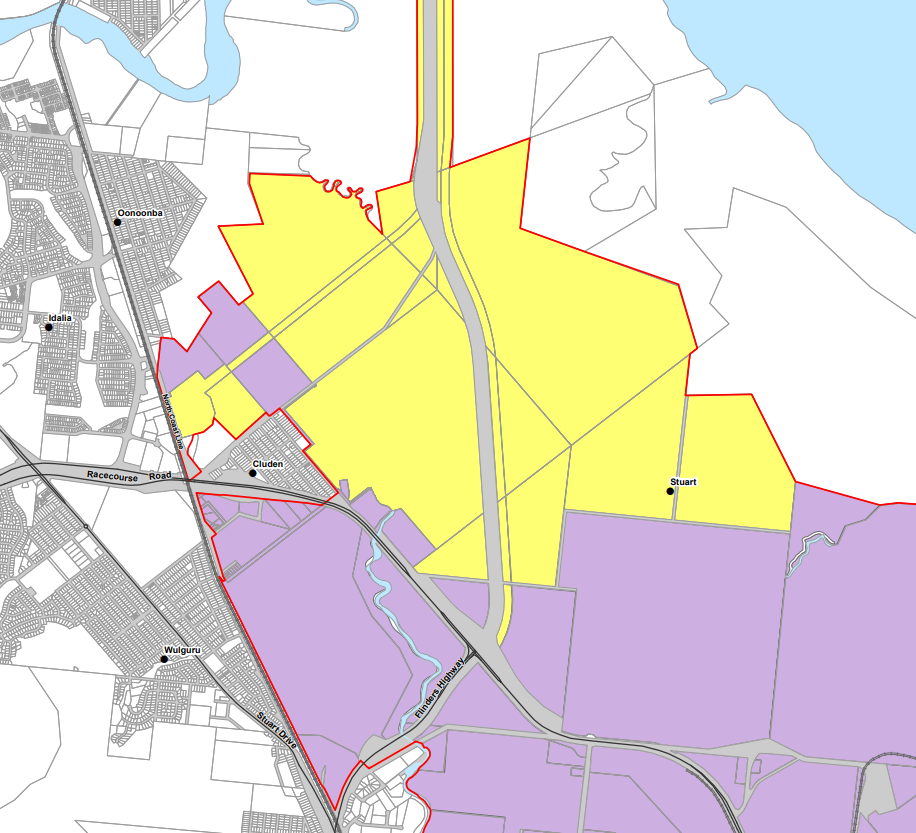
		- 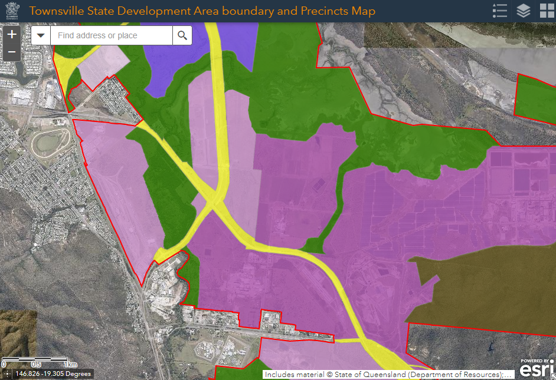
	- Lot no: Lot 50 SP 331993
	- Area: 59954.0194 sqm ~ 6 hectares
	- Property for lease: https://www.commercialrealestate.com.au/property/townsville-port-road-stuart-qld-4811-16098231
	- 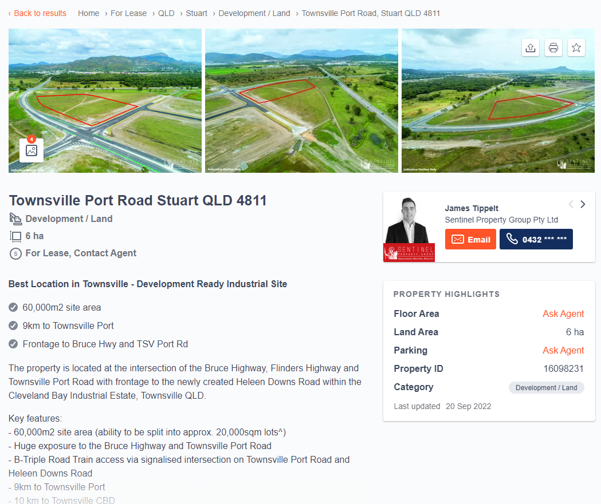
	  <<<<<<< HEAD
	- Cleveland Bay Industrial Estate - Kiernan Investments Pty Ltd
		- The Cleveland Bay Industrial Park (CBIP) master-planned industrial estate, will provide 125 hectares of fully serviced freehold industrial lots for development either side of the Townsville Port Access Road in the Townsville SDA.
		- Suitable industrial uses will include medium-impact industry such as freight terminals, transport depots, research and technology industries, warehouses and infrastructure facilities and the location will allow for 24/7 operations.
		- The CBIP has direct access to the Townsville Port Access Road, connecting to the Port of Townsville, the Bruce and Flinders Highways and planned infrastructure includes a signalised intersection to cater for Type 2 road train access to all industrial lots.
		- Site works commenced in October 2021 on the western side of the development, with stage 1 and 2 lots available for industrial development now. Further stages 3, 4 and 5 will be available soon. Site works commenced on the eastern side of the development in October 2022 with sites expected to be ready for industrial development towards the end of 2023.
- Waste Water Catchment 7870
  =======
	-
- ## Waste Water Catchment 7870
  >>>>>>> eea33e2 ([logseq-plugin-git:commit] 2023-04-04T01:58:11.995Z)
	- 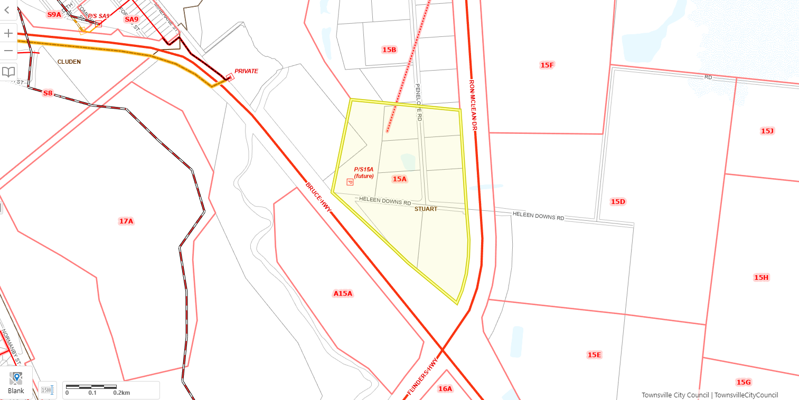
- Flooding
	- 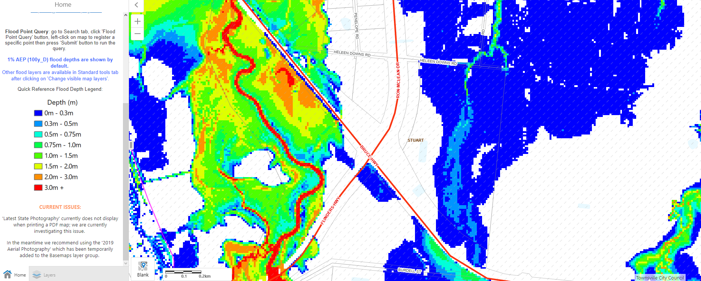
	- Author: AECOM
	- Name: LowerStuart
	- Critical duration: 24h
	- Date: Dec 8, 2011 10:00 AM
	- Flood Study: Townsville State Development Area - Flood Modelling
- ## Zoning: Special Purpose
	- QLD Planning Zone Card: https://dsdmipprd.blob.core.windows.net/general/planning-zone-cards-29-special-purpose-zone.pdf
	- 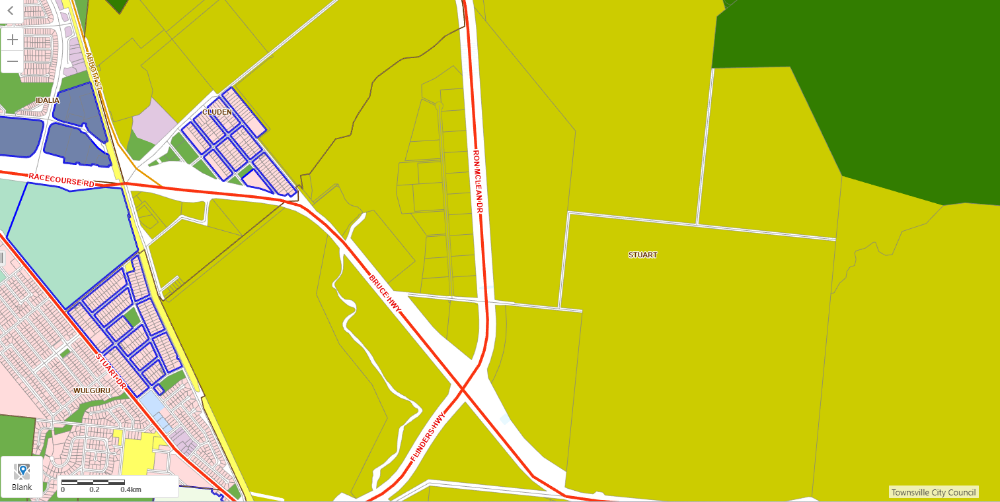
- ## Industry precinct
	- 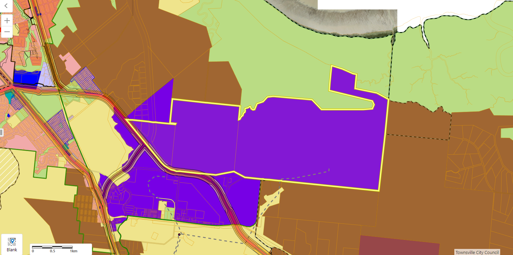
- ## Bushfire hazards
	- 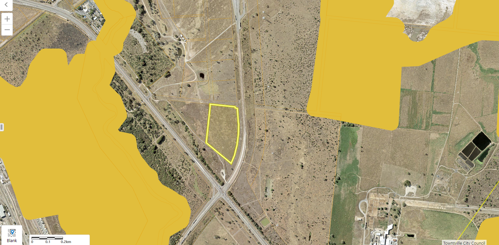
- ## Environmental Coastal hazards areas - storm tide inundation areas and erosion area from sea level rise
	- 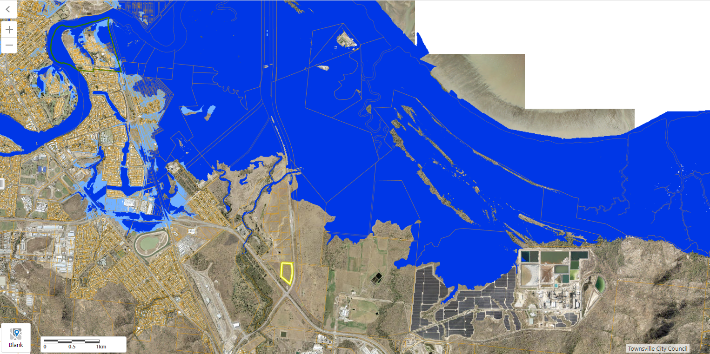
- ## Development Constraints Flood hazard
	- 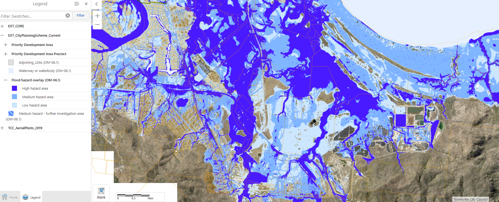
- ## Landslide slope: not exist
- ## Natural Assets Environment Importance
  collapsed:: true
	- 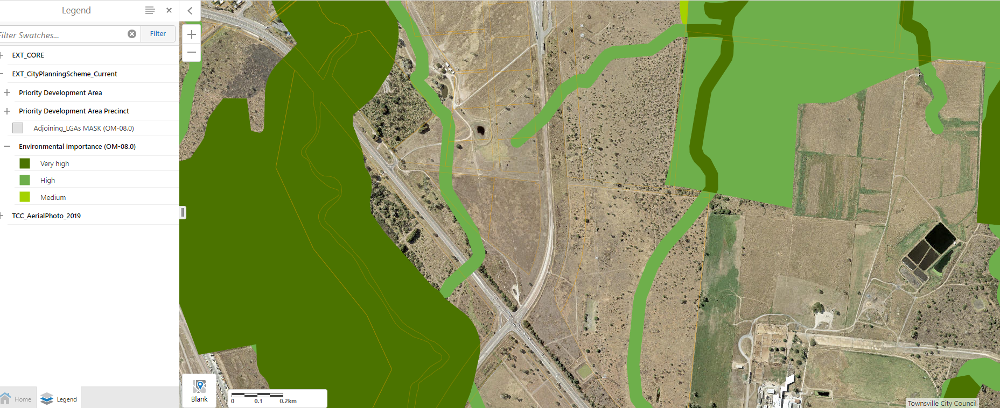
- ## Natural Water Resource Catchment: NIL
- ## Infrastructure Road Noise Corridors; Rail Noise Corridors
	- 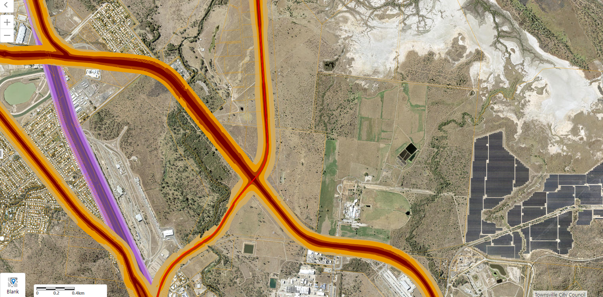
	  id:: 6423ae75-306a-4863-bbaa-723de803a6aa
- ## Acid Sulphate soils
	- 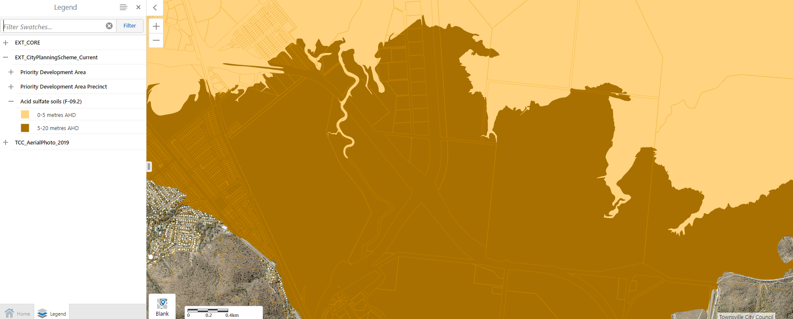
-
- ## Test
	- {:height 460, :width 746}
-